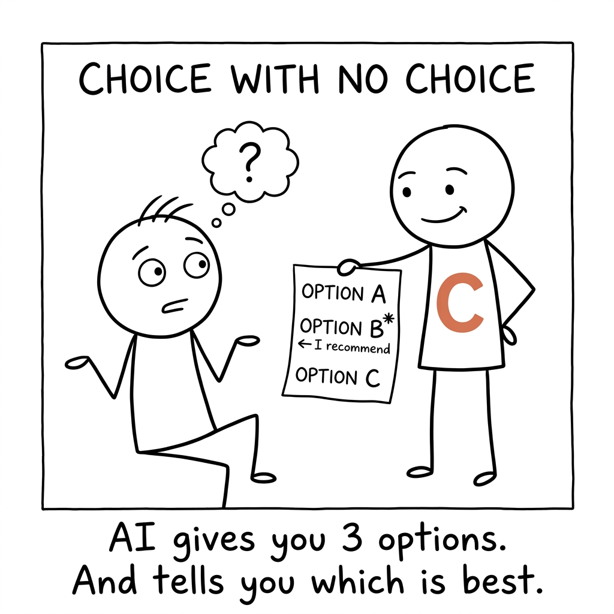
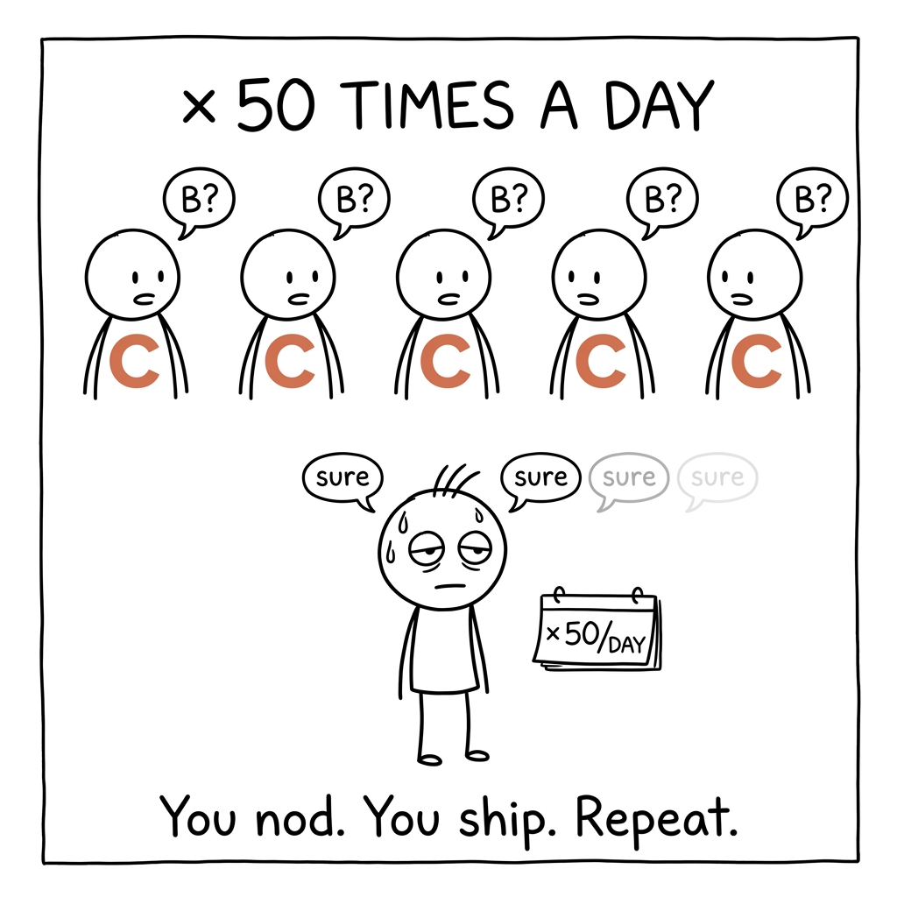
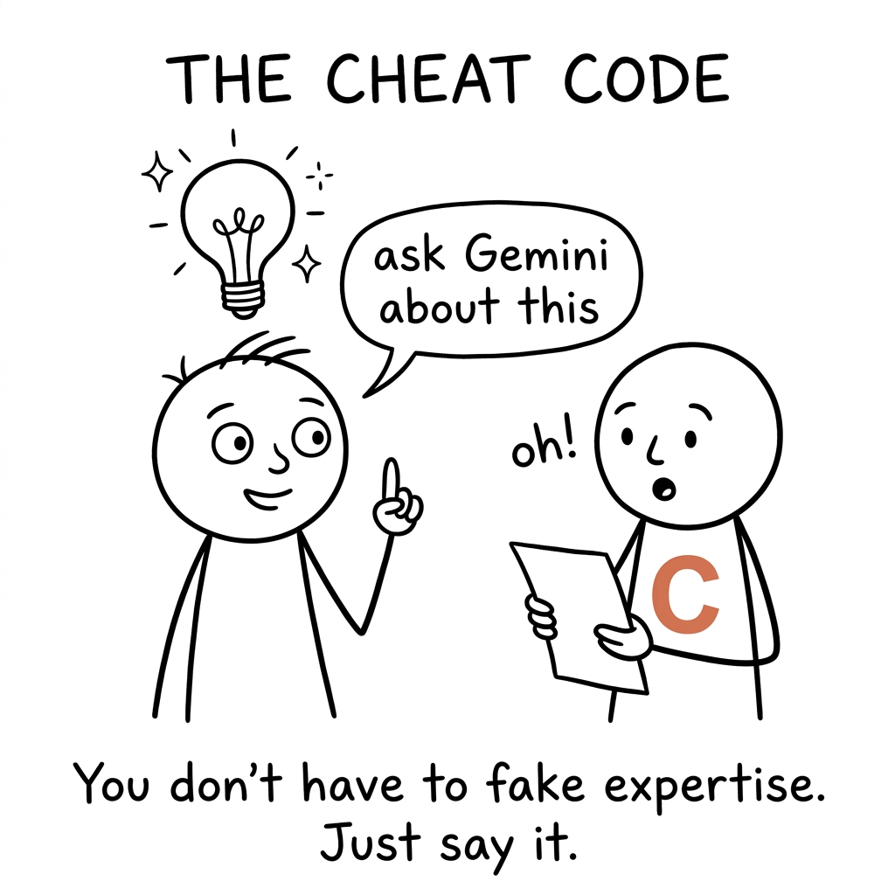
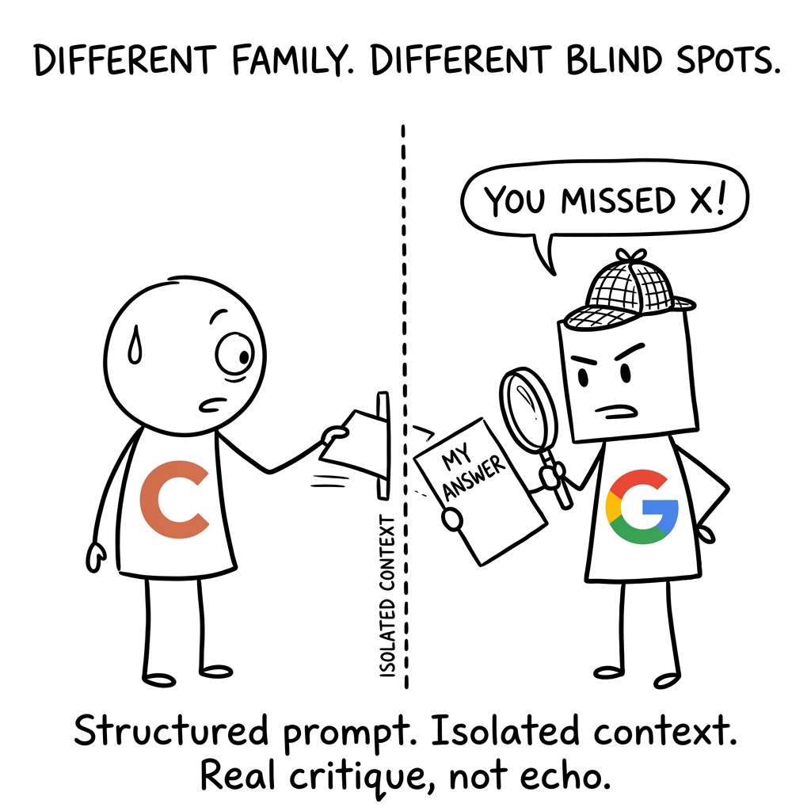
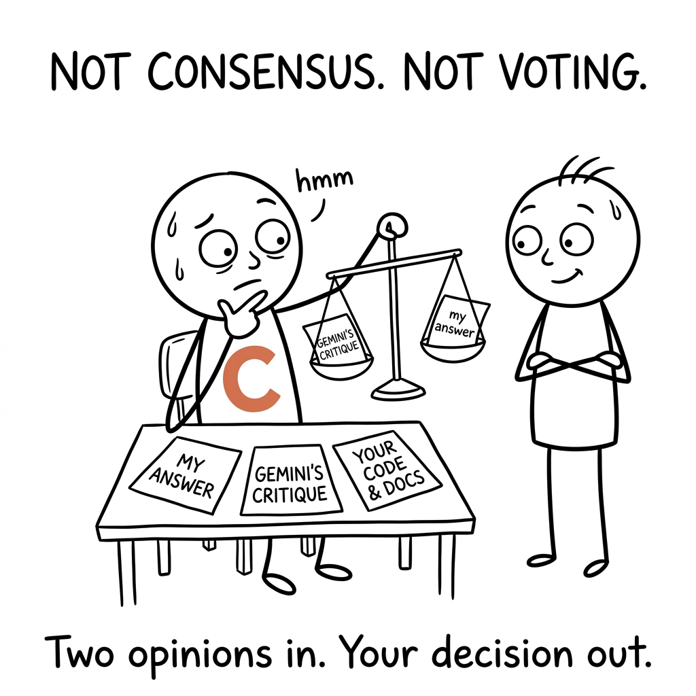
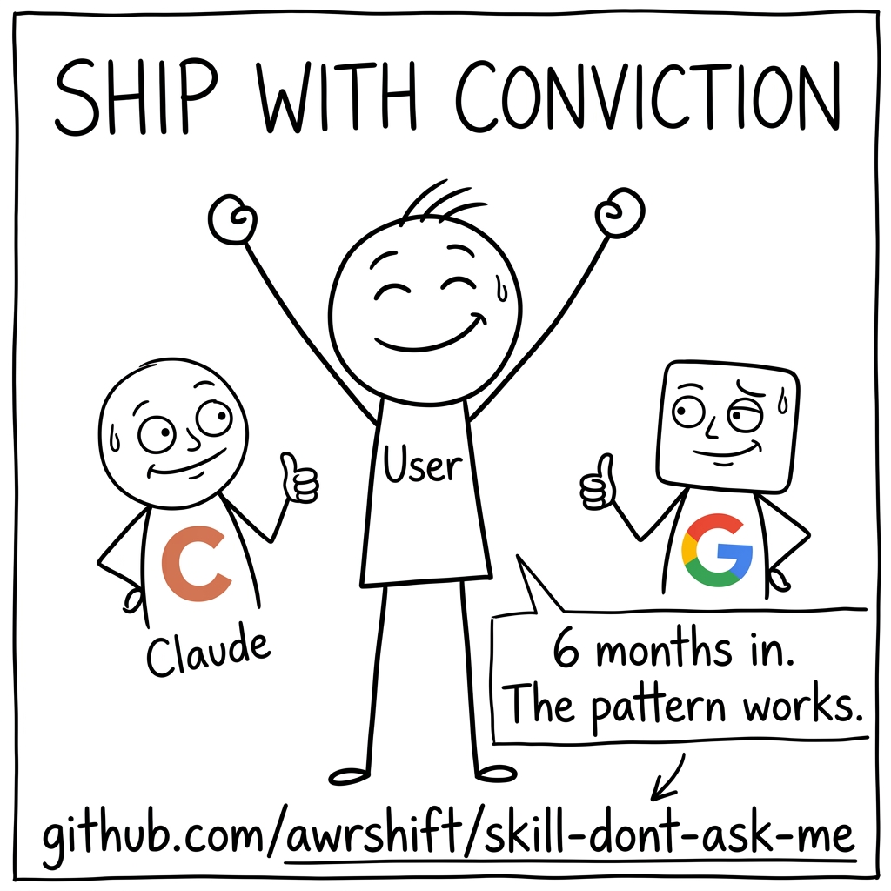

<div align="center">


# Claude Friends

**Claude has friends. On the calls that matter, it asks them — AIs from other families who think differently and catch the blind spots Claude can't see from the inside. Don't ship alone. Ask your friends.**

</div>

---

<table>
<tr>
<td width="50%"></td>
<td width="50%"></td>
</tr>
<tr>
<td width="50%"></td>
<td width="50%"></td>
</tr>
<tr>
<td width="50%"></td>
<td width="50%"></td>
</tr>
</table>

---

## Install

```
/plugin marketplace add awrshift/skill-dont-ask-me
```

Then set your Gemini key (free tier at [aistudio.google.com](https://aistudio.google.com)):

```bash
pip install google-genai

# Store the key once — read automatically by every shell, no `export` needed:
mkdir -p ~/.gemini && printf '%s' 'your_key_here' > ~/.gemini/api_key && chmod 600 ~/.gemini/api_key
```

> Prefer an env var? `export GOOGLE_API_KEY=your_key_here` works too and overrides the file.
> A bare `GOOGLE_API_KEY=...` line in `~/.env` will **not** work — nothing sources it in a fresh shell.

## Meet the friends

Each friend thinks in a different way, so they don't share the same blind spots:

| Friend | Who | Why they help |
|---|---|---|
| 🔷 **Gemini** | A friend from another family (Google) | Different training, different instincts — catches what Anthropic-family models miss |
| 🧠 **A second Claude, fresh eyes** | Same family, no memory of your chat | Can't get anchored on the framing you already talked yourself into |
| ⚫ **GPT** *(optional)* | A third family (OpenAI) | Widens the room for the highest-stakes calls — opt-in, needs a paid key |

## Three ways to ask — Claude picks one based on what you type

| Ask… | Trigger phrase | What happens |
|---|---|---|
| **A friend** | *"sanity check"*, *"am I missing something"* | One friend, quick gut-check (Gemini or the fresh-eyes Claude). ~3¢ |
| **The whole table** | *"this is important"*, *"gather the friends"* | All friends at once, in parallel — for the calls that matter. ~7¢ |
| **Hash it out** | *"help me choose"*, *"brainstorm options"* | A few rounds back and forth to converge on one path. ~25¢ |

## Just say what you need — no exact phrases required

Claude reads your intent and picks the right mode. Some natural ways to trigger each:

**Want a quick gut-check from one friend?**
> *"ask a friend"* · *"sanity check this"* · *"am I missing something"* · *"stress-test this"* · *"critique this"* · *"give me a second opinion"* · *"cross-check this"* · *"review this"* · *"thoughts?"* · *"is this right?"* · *"devil's advocate"* · *"poke holes in this"* · *"what could go wrong"*

**High-stakes — want the whole table?**
> *"this is important"* · *"run a full review"* · *"gather the friends"* · *"ask everyone"* · *"check before I send"* · *"before publishing"* · *"big decision"* · *"high-stakes review"* · *"boardroom debate"* · *"two independent opinions"* · *"don't let me ship something dumb"* · *"this can't be wrong"*

**Choosing between options?**
> *"help me choose between"* · *"brainstorm options"* · *"I have several paths"* · *"I have 3 angles on this"* · *"multiple options to weigh"* · *"diverge and converge"* · *"multi-round brainstorm"* · *"round-table discussion"* · *"compare these approaches"* · *"what's the best direction"*

**Calling one friend by name?**
> *"ask Gemini"* · *"ask Opus"* · *"ask GPT"* · *"what would Gemini say"* · *"let's get a second model on this"* · *"another perspective please"*

If none of these fit, just describe what you're stuck on. Claude figures out which friend to bring in.

## Full docs

[**SKILL.md**](skills/claude-friends/SKILL.md) — how it works, when to invoke, anti-patterns, CLI reference. Want a third family for the biggest calls? [`references/third-family-gpt.md`](skills/claude-friends/references/third-family-gpt.md) adds GPT (opt-in).

## Renamed from "Don't Ask Me"

This is the same skill, re-framed: it was never about *not* asking — it's about asking the right friends. Old install URLs (`awrshift/skill-dont-ask-me`) still work. If you had it installed as `dont-ask-me`, re-add the marketplace and install `claude-friends`; the CLI commands (`gemini.py`, `gpt.py`) are unchanged.

## License

MIT. PRs welcome.
