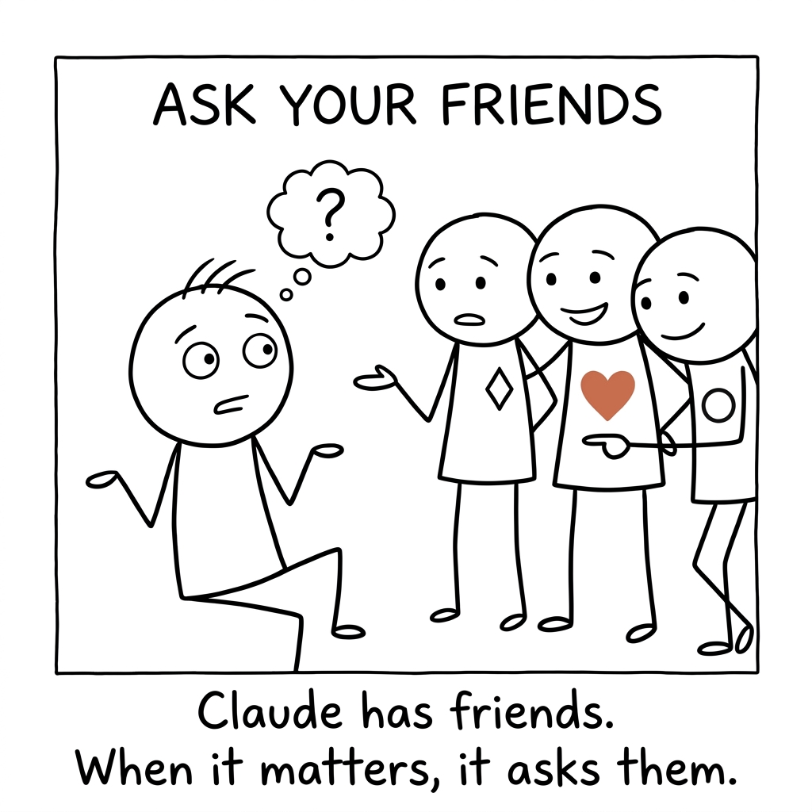
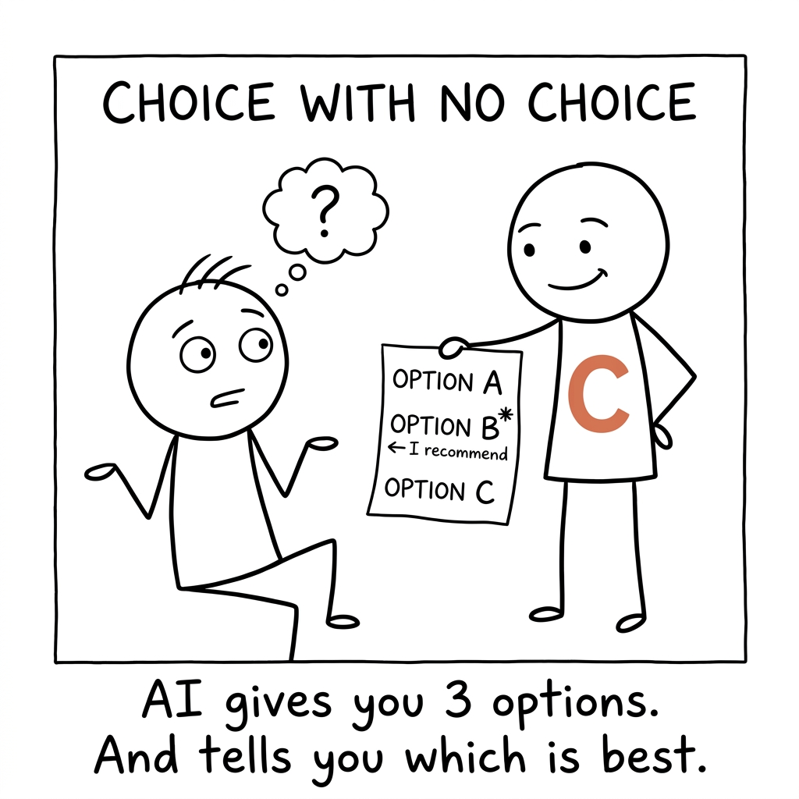
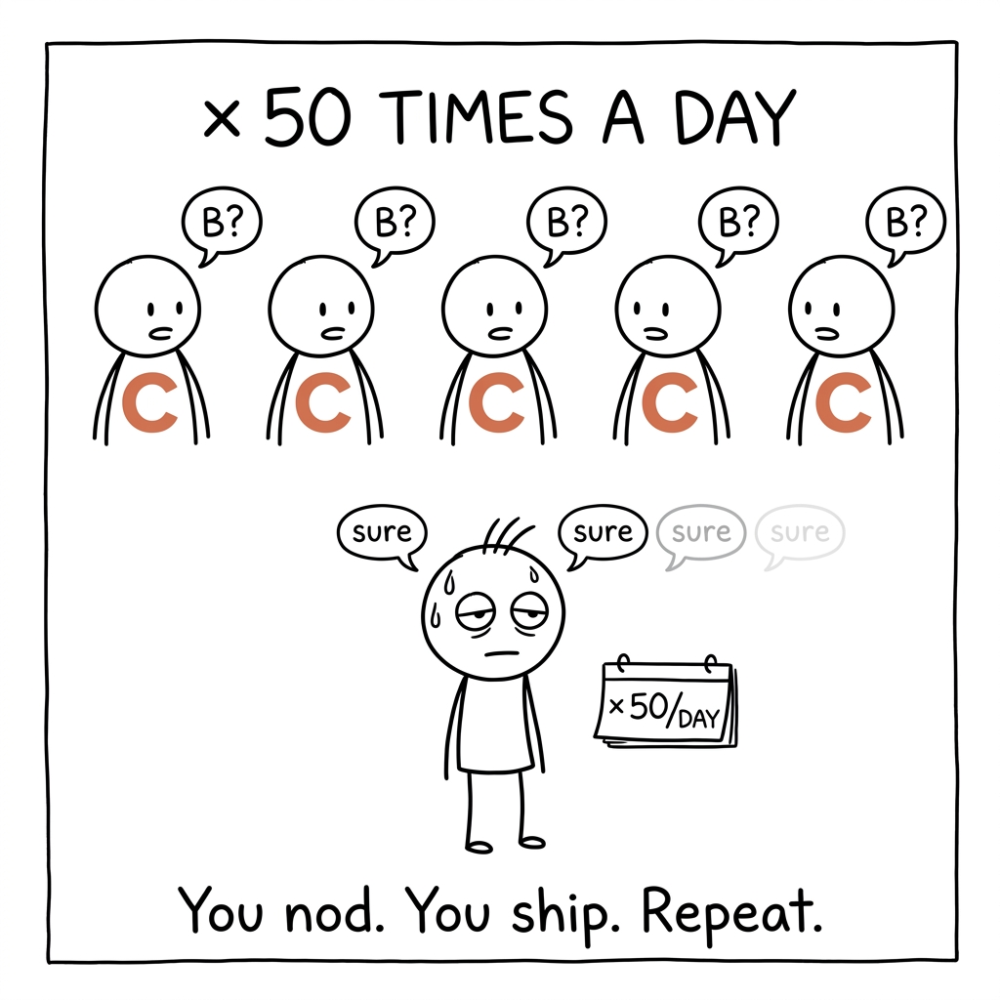
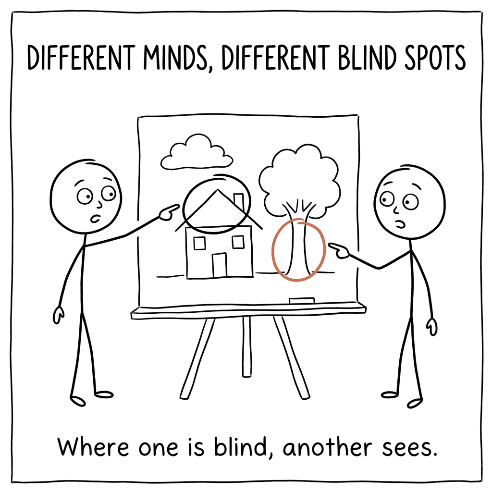
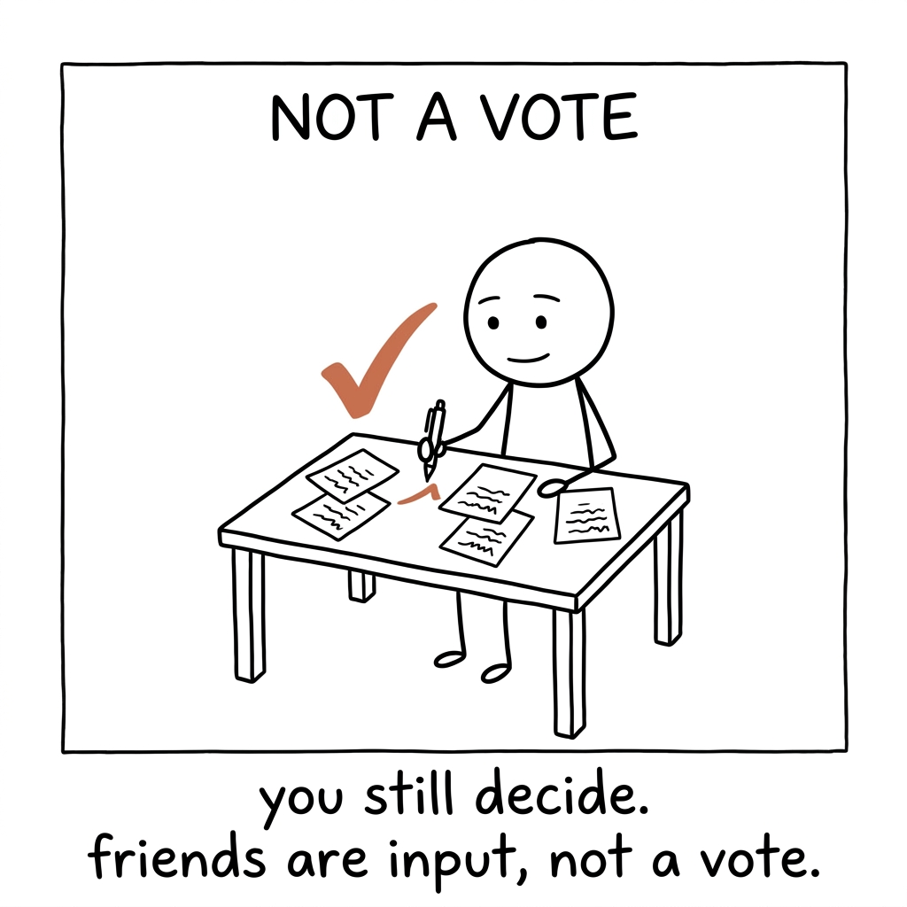
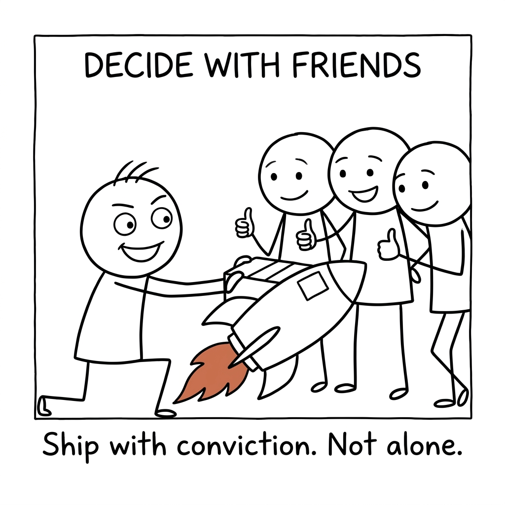

<div align="center">


[](https://github.com/awrshift/claude-friends/releases)
[](LICENSE)

# Claude Friends

**Before the calls that matter, Claude asks AIs from other families — and tells you where they disagree.**

</div>

```shell
/plugin marketplace add awrshift/claude-friends
/plugin install claude-friends@awrshift-claude-friends
```

Then say *"sanity check this"*, *"this is important"* or *"help me choose"* in any session.
Claude picks the review style from your phrasing, runs the reviewers, and reports where they
agree, where they split, and what it decided — reviewers are **input, never a vote**.



## Why more than one model

A single model's blind spots are systematic: it will make the same class of mistake confidently,
twice, when you ask it twice. The fix is not a second pass — it is a different vantage point.

| Reviewer | What it is | What it is good for |
|---|---|---|
| **Gemini** | A different vendor and training distribution (Google) | Concepts, current practice, blind spots the Anthropic family shares |
| **A second Claude, fresh eyes** | Same family, isolated — no memory of your conversation | File-level facts. It reads the actual code and cannot anchor on the framing you already talked yourself into |
| **GPT** *(opt-in)* | A third family (OpenAI), needs a paid key | Widening the room on the highest-stakes calls only |

The external reviewers see the brief you send, not your repository. That is deliberate: it keeps
private code with one vendor and keeps the honest split — outside families for judgement and
currency, the isolated Claude for anything that requires reading your files.

## Three styles, picked from what you type

| You say | What runs | Typical cost |
|---|---|---|
| *"sanity check"*, *"am I missing something"* | **One friend** — a single critique | ~3¢ |
| *"this is important"*, *"before I ship"* | **The whole table** — reviewers in parallel, then adjudication | ~7¢ |
| *"help me choose"*, *"brainstorm options"* | **Round-table** — several rounds converging on one path | ~25¢ |

<details>
<summary>The full list of phrases that trigger each style</summary>

**One friend:** ask a friend · sanity check this · am I missing something · stress-test this ·
critique this · give me a second opinion · cross-check this · review this · thoughts? ·
is this right? · devil's advocate · poke holes in this · what could go wrong

**The whole table:** this is important · run a full review · ask everyone · gather the friends ·
check before I send · before publishing · big decision · high-stakes review · boardroom debate ·
two independent opinions · don't let me ship something dumb · this can't be wrong

**Round-table:** help me choose between · brainstorm options · I have several paths ·
I have 3 angles on this · multiple options to weigh · diverge and converge ·
multi-round brainstorm · compare these approaches · what's the best direction

**By name:** ask Gemini · ask Opus · ask GPT · what would Gemini say ·
let's get a second model on this

You do not need an exact phrase — describe what you are stuck on and Claude picks the style.

</details>

## Setup

The plugin calls two small CLI scripts. No MCP server, nothing running in the background.

```bash
pip install google-genai

# stored once, read by every shell — no export needed
mkdir -p ~/.gemini && printf '%s' 'YOUR_KEY' > ~/.gemini/api_key && chmod 600 ~/.gemini/api_key
```

A free key from [aistudio.google.com](https://aistudio.google.com) is enough to start.
`GOOGLE_API_KEY` in the environment also works and takes precedence. A bare line in `~/.env`
does **not** — nothing sources it in a fresh shell.

GPT is optional and needs a paid OpenAI key in `~/.openai/api_key`; see
[`references/third-family-gpt.md`](skills/claude-friends/references/third-family-gpt.md).

## What it will not do

- **It is not a fact lookup.** "What is the latest X" is a job for WebSearch. This is critique.
- **It is not a vote.** Three reviewers agreeing is not evidence; one dissenter holding a
  `file:line` outranks three abstract concurrences. The skill adjudicates on merits and says so.
- **It does not run itself.** It fires when you signal uncertainty, not on every answer.
- **It cannot see what you did not send.** External reviewers get the brief; if the brief is
  wrong, the review is confidently wrong with it.

## Docs

| | |
|---|---|
| [SKILL.md](skills/claude-friends/SKILL.md) | how the three styles run, anti-patterns, CLI reference |
| [references/models.md](skills/claude-friends/references/models.md) | the model whitelist, with the date it was last verified against the live API |
| [docs/DECISIONS.md](docs/DECISIONS.md) | the open decisions board |
| [docs/CHANGELOG.md](docs/CHANGELOG.md) | version history, including the rename from *Don't Ask Me* |

<details>
<summary>The idea in six frames</summary>

<table>
<tr>
<td width="50%"></td>
<td width="50%"></td>
</tr>
<tr>
<td width="50%"></td>
<td width="50%"></td>
</tr>
<tr>
<td width="50%"></td>
<td width="50%"></td>
</tr>
</table>

</details>

## License

MIT. Issues and PRs welcome — see [docs/CONTRIBUTING.md](docs/CONTRIBUTING.md).
